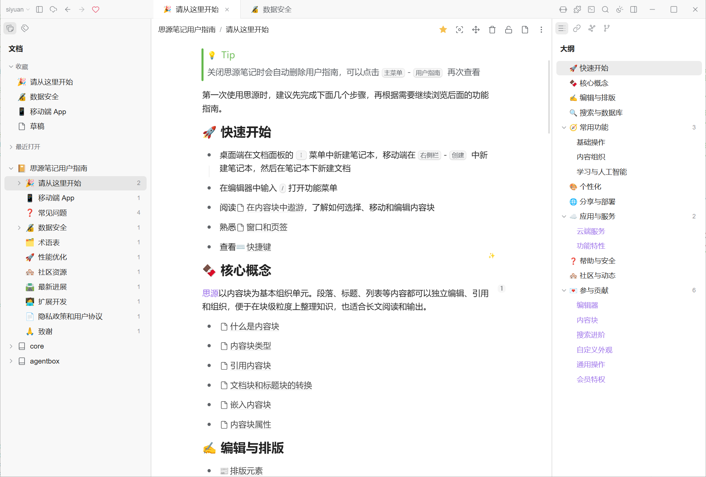
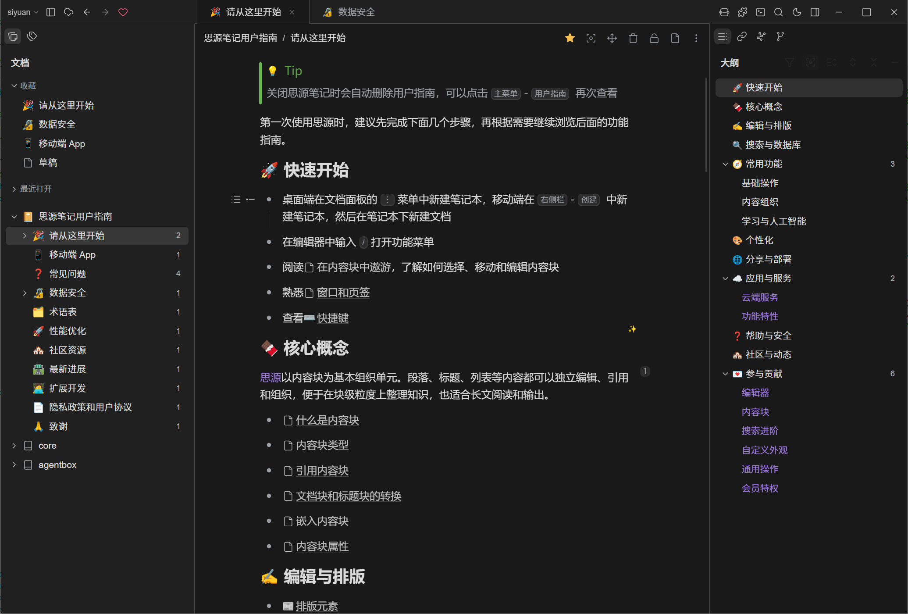
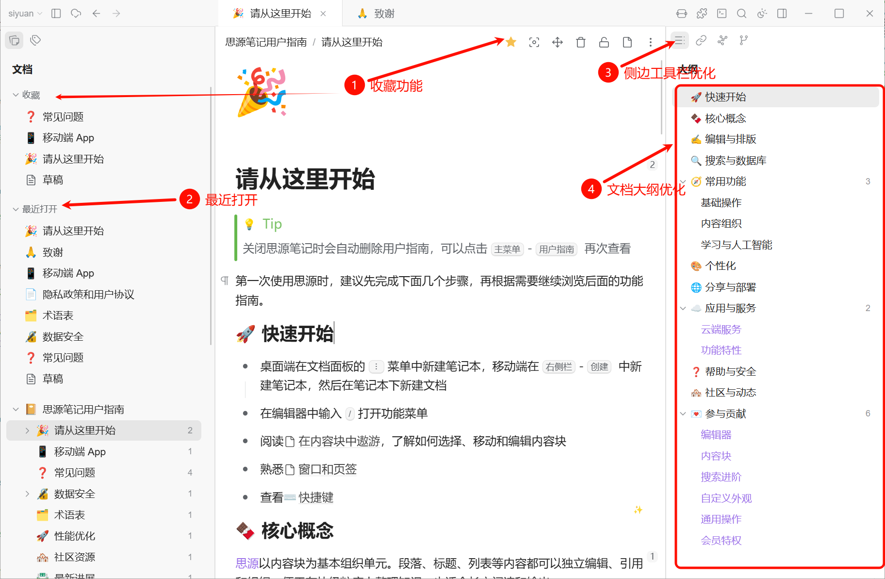

# cursor极简

Currently matched versions: theme **v2.0.11**, plugin **v1.2.10**.

**Inspired by Cursor and Notion: a clean, modern layout and interaction. Adds CJK-Latin spacing, image optimization, favorites, and other highly requested features. Please install the cursor极简 theme and the cursor极简工具 plugin together.**

Installing only the **cursor极简** theme without the **cursor极简工具** plugin: no favorites, child-doc index, or config sync.

Installing only the **cursor极简工具** plugin without the **cursor极简** theme: sidebar layout and look will not match.

Set **cursor极简** for both light and dark. Settings: Plugins menu → **cursor极简工具**.

## Preview

**Light**

**Dark**

## Highlights

### 1. Display

- Calmer chrome, quieter sidebars, more room to write.
- Favorites and recently opened in the file tree, Notion-like.
- Outline drops Hx marks, bolds H1, keeps hierarchy clear.

### 2. Documents

- Breadcrumb shows the document path.
- Star to favorite the current doc without digging through native menus.
- Recently opened list on the file tree.
- Auto-inserts a child-doc index block; you can delete children from that index.

### 3. Hidden chrome

- Hide unused sidebar dock buttons.
- Hide unused slash-menu commands.

### 4. Editing

- Auto space between Chinese and Latin text.
- Images scale by DPI so they do not explode, and center themselves.
- Optional document-ref icons.
- Adjustable block line height.

### 5. Config sync

- App settings do not sync across machines. One-click sync for config and installed themes.

---

## Display

Stock SiYuan is busy. This overlay sits on daylight / midnight and only changes layout.

Dock icons sit on a top strip in the sidebar so the editor stays wide.

Favorites and recents are simple lists. The row you click is the only highlight.

The outline hides the doc name and Hx badges, bolds top-level headings, and follows the caret.

## Finding docs and child pages

The stock breadcrumb follows block headings, not the file tree.

Here it is notebook / folder / current doc. When space runs out, middle levels become `...`; hover shows the path up to that level.

Native favorites are buried. One star on the breadcrumb pins the current doc.

Recents sit at the top of the file tree.

Unlike Notion, SiYuan does not index child docs in the body by default.

Opening a doc injects the current-level child-doc blocks. You can also delete those children from the index.

## Too many buttons

The vertical dock strip eats space. Hide what you do not use (layout switches need this theme).

The slash menu gets long. Turn off commands you never pick.

## Editing

Chinese stuck to English is hard to read. Spaces are inserted on type and paste.

High-DPI pastes make huge images. Width follows system DPI; image paragraphs center.

Document-ref icons are on by default so they do not look like plain text.

Block line height is a slider in Style.

## Config across PCs

SiYuan does not sync `/conf` settings or custom themes.

Config sync copies them into workspace data, then uses official sync.

Overwrite on one machine, download on the other, then restart.

Turn on SiYuan cloud sync or S3 first.

## Install

1. Install theme **cursor极简** for light and dark.
2. Install and enable the companion plugin **cursor极简工具**. The theme and plugin must be used together.
3. Disable **fhelper** if it is still on, or child-doc index will double.
4. Restart SiYuan if the sidebar strip did not mount.

Theme: [cursorart](https://github.com/fyuanace/cursorart) · Plugin: [cursorart-tools](https://github.com/fyuanace/cursorart-tools)

## Support the author

If this theme or plugin helps you, please visit the [support page](https://siyuan.ysoft.site) to like it, join the QQ group, or sponsor. QQ group: `1091105807`.

## Changelog

### Theme cursor极简

#### v2.0.11

- Intro now names both the cursor极简 theme and the cursor极简工具 plugin and asks to use them together

#### v2.0.10

- Converted `preview.png` to a real PNG so bazaar format checks pass

#### v2.0.9

- Chinese README light/dark previews now use image files so they render on GitHub
- Added a Support the author section

#### v2.0.8

- Theme and plugin now share one intro, with feature screenshots
- Marketplace blurb now cites Cursor / Notion and asks to use the theme and plugin together

#### v2.0.7

- Breadcrumb fills leftover width; middle levels collapse to `...` when tight; hover shows the path up to that level

#### v2.0.6

- Four-region layout CSS applies by default, even if the plugin has not loaded

#### v2.0.5

- Adaptive title-bar height is a toggle
- Settings panel CSS lives in the plugin, so it still looks right on other themes

#### v2.0.4

- Title-bar height is pure CSS via DPI / `resolution` (~55 device pixels)

#### v2.0.3

- Removed `theme.js` for bazaar rules; interactions move to [cursorart-tools](https://github.com/fyuanace/cursorart-tools)

#### v2.0.2

- Marketplace icon updated to the Cursor app mark
- Settings label: reset like button

#### v2.0.1

First public release.

- Minimal four-region layout on daylight / midnight
- File-tree favorites and recents, path breadcrumb, document-ref style, quieter outline that follows the editor

### Plugin cursor极简工具

#### v1.2.10

- Like-heart click is stored in `config.json`, so it stays hidden after restart
- Intro now names the cursor极简 theme and cursor极简工具 plugin and asks to use them together

#### v1.2.9

- Config sync: overwrite syncs the cloud baseline before rebuilding the cache; download no longer wipes the cache first, so an empty folder is not pushed to the cloud
- Writing the petal cache no longer reloads the plugin, so overwrite no longer flickers
- The syncing toast and the result share one message and auto-dismiss
- Dialogs stack in open order; the restart confirm sits above Settings

#### v1.2.8

- Removed the non-standard `i18n` field from `plugin.json` (locale files stay in `i18n/`)

#### v1.2.7

- Converted `preview.png` to a real PNG so bazaar format checks pass

#### v1.2.6

- Added a Support the author section

#### v1.2.5

- Shares the same intro as the theme, with feature screenshots
- Marketplace blurb now cites Cursor / Notion and asks to use the theme and plugin together

#### v1.2.4

- Breadcrumb uses leftover width; first/last stay full; middle levels collapse to `...` with a prefix-path tooltip

#### v1.2.3

- Locate in tree unpins favorites/recents, expands the official tree, and scrolls the target to the middle

#### v1.2.2

- Factory defaults match the usual setup; About can restore defaults (keeps favorites and recents)
- Document-ref style on by default

#### v1.2.1

- Regular document refs no longer bold; icon and underline remain

#### v1.2.0

- Merged fhelper: child-doc index, image DPI, CJK spacing, slash filter, config sync
- Six tabs; live apply without Save

#### v1.1.0

- Settings panel CSS injected by the plugin; sidebar layout switches require cursor极简

#### v1.0.2

- Title-bar height handed back to theme CSS

#### v1.0.1

- Top dock strip only when cursor极简 is active

#### v1.0.0

- First release; takes over theme interactions
